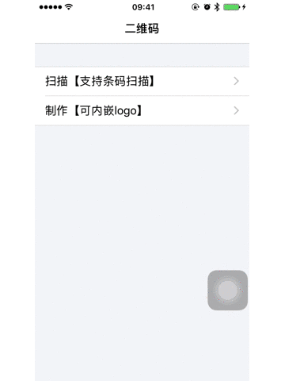

# MMScanner

[](https://raw.githubusercontent.com/CheeryLau/MMScanner/master/LICENSE)&nbsp;
[](https://cocoapods.org/pods/MMScanner)&nbsp;
[](https://cocoapods.org/pods/MMScanner)&nbsp;

iOS源生二维码扫描和制作工具，轻量级UI，UI也可根据属性自行修改。支持条形码扫描以及识别图片中的二维码，制作二维码可以指定颜色、大小、可嵌入logo。



## 使用 

1. `pod "MMScanner"`;
2. `pod install / pod update`;
3. `#import <MMScannerController.h>`
4. `info.plist`中添加`Privacy - Camera Usage Description`和`Privacy - Photo Library Usage Description`

## 二维码扫描 

`MMScannerController`外部可修改属性如下，使用时可自行设置。

```objc
// 透明的区域[扫描区 | 默认：左边距40，上边距80]
@property (nonatomic, assign) CGRect qrScanArea;
// 动画间隔时间 [默认值:0.01]
@property (nonatomic, assign) double qrScanLineAnimateDuration;
// 四角颜色 [默认：白色]
@property (nonatomic, strong) UIColor *qrScanLayerBorderColor;
// 扫描线图片 [默认：使用bundle下的scan_line]
@property (nonatomic, copy) NSString *qrScanLineImageName;
// 是否支持条码 [默认显示：NO]
@property (nonatomic, assign) BOOL supportBarcode;
// 是否显示'手电筒'[默认显示：NO]
@property (nonatomic, assign) BOOL showFlashlight;
// 是否显示'图库'[默认显示：NO]
@property (nonatomic, assign) BOOL showGalleryOption;
// 扫描内容回传
@property (nonatomic, copy) void (^completion)(NSString *scanConetent);

// 扫描控制
- (void)startScan;
- (void)stopScan;
```

示例如下：

```objc
_scanner = [[MMScannerController alloc] init];
_scanner.showGalleryOption = YES;
_scanner.showFlashlight = YES;
_scanner.supportBarcode = YES;
[_scanner setCompletion:^(NSString *scanConetent) {
    UIAlertView *alertView = [[UIAlertView alloc] initWithTitle:@"扫描内容如下："
                                                        message:scanConetent
                                                       delegate:weakSelf
                                              cancelButtonTitle:@"确定"
                                              otherButtonTitles:nil, nil];
    [alertView show];
}];
[self.navigationController pushViewController:_scanner animated:YES];
```

### 二维码制作

`MMCodeMaker`提供同步和异步制作方式：

```objc
/**
制作二维码[同步]

@param qrContent 二维码内容
@param logoImage 中间的填充图片[logo]
@param qrColor 二维码颜色
@param qrWidth 二维码宽度
@return 二维码
*/
+ (UIImage *)qrImageWithContent:(NSString *)qrContent
                      logoImage:(UIImage *)logoImage
                        qrColor:(UIColor *)qrColor
                        qrWidth:(CGFloat)qrWidth;

/**
制作二维码[异步]

@param qrContent 二维码内容
@param logoImage 中间的填充图片[logo]
@param qrColor 二维码颜色
@param qrWidth 二维码宽度
@param completion 完成回调
*/
+ (void)qrImageWithContent:(NSString *)qrContent
                 logoImage:(UIImage *)logoImage
                   qrColor:(UIColor *)qrColor
                   qrWidth:(CGFloat)qrWidth
                completion:(void (^)(UIImage *image))completion;
```

示例如下：

```objc
NSString *qrContent = @"Hello, this is a two-dimensional code";
UIImage *qrImage = [MMCodeMaker qrImageWithContent:qrContent
                                         logoImage:[UIImage imageNamed:@"logo.jpg"]
                                           qrColor:[UIColor blackColor]
                                           qrWidth:240];
```

## END

如有问题，欢迎给我[留言](https://github.com/CheeryLau/MMScanner/issues)，如果这个工具对你有些帮助，请给我一个star，谢谢。😘😘😘😘

💡 💡 💡 
欢迎访问我的[主页](https://github.com/CheeryLau)，希望以下工具也会对你有帮助。

1、自定义视频采集/图像选择及编辑/音频录制及播放等：[MediaUnitedKit](https://github.com/CheeryLau/MediaUnitedKit)

2、类似滴滴出行侧滑抽屉效果：[MMSideslipDrawer](https://github.com/CheeryLau/MMSideslipDrawer)

3、图片选择器基于AssetsLibrary框架：[MMImagePicker](https://github.com/CheeryLau/MMImagePicker)

4、图片选择器基于Photos框架：[MMPhotoPicker](https://github.com/CheeryLau/MMPhotoPicker)

5、webView支持顶部进度条和侧滑返回:[MMWebView](https://github.com/CheeryLau/MMWebView)

6、多功能滑动菜单控件：[MenuComponent](https://github.com/CheeryLau/MenuComponent)

7、仿微信朋友圈：[MomentKit](https://github.com/CheeryLau/MomentKit)

8、图片验证码：[MMCaptchaView](https://github.com/CheeryLau/MMCaptchaView)

9、源生二维码扫描与制作：[MMScanner](https://github.com/CheeryLau/MMScanner)

10、简化UIButton文字和图片对齐：[UUButton](https://github.com/CheeryLau/UUButton)

11、基础组合动画：[CAAnimationUtil](https://github.com/CheeryLau/CAAnimationUtil)

