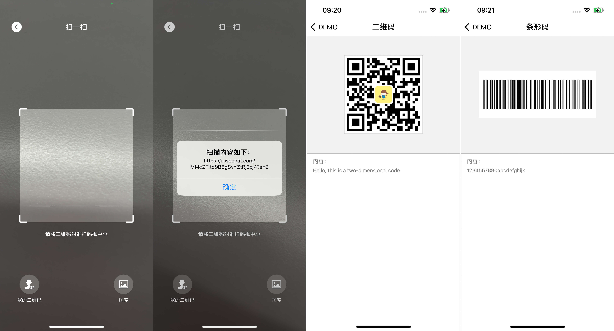

# MMScanner

[](https://raw.githubusercontent.com/ChellyLau/MMScanner/master/LICENSE)&nbsp;
[](https://cocoapods.org/pods/MMScanner)&nbsp;
[](https://cocoapods.org/pods/MMScanner)&nbsp;

iOS源生二维码/条形码扫描和制作工具，轻量级UI，支持条形码扫描以及识别图片中的二维码，制作二维码可以指定颜色、大小、可嵌入logo等。



## 使用 

1. `pod "MMScanner"`;
2. `pod install / pod update`;
3. `#import <MMScannerController.h>`
4. `info.plist`中添加`Privacy - Camera Usage Description`和`Privacy - Photo Library Usage Description`

## 扫描 

属性：

```objc
// 代理
@property (nonatomic, weak) id<MMScannerDelegate> delegate;
// 是否支持条码 [默认显示：NO]
@property (nonatomic, assign) BOOL supportBarcode;

// 扫描控制
- (void)startScan;
- (void)stopScan;
```
代理：

```objc
@protocol MMScannerDelegate <NSObject>

@optional
// 扫描结果返回
- (void)onScanResultCallback:(NSString *)scanContent;
// 进入【我的二维码】
- (void)onScanMineClickCallback;
// 进入【图库】并回传图片
- (void)onScanAlbumClickCallback:(void (^)(UIImage *image))callback;

@end
```

示例如下：

```objc
MMScannerController *scanner = [[MMScannerController alloc] init];
scanner.supportBarcode = YES;
scanner.delegate = self;
[self.navigationController pushViewController:scanner animated:YES];
```

## 制作

`MMCodeMaker`提供条形码以及同步/异步二维码制作方法：

```objc
/**
 生成条形码

 @param content 内容
 @param imageSize 图片大小
 @return 图片
 */
+ (UIImage *)barCodeImageWithContent:(NSString *)content
                                size:(CGSize)imageSize;
                                
/**
制作二维码[同步]

@param qrContent 二维码内容
@param logoImage 中间的填充图片[logo]
@param qrColor 二维码颜色
@param qrWidth 二维码宽度
@return 二维码
*/
+ (UIImage *)qrImageWithContent:(NSString *)qrContent
                      logoImage:(UIImage *)logoImage
                        qrColor:(UIColor *)qrColor
                        qrWidth:(CGFloat)qrWidth;

/**
制作二维码[异步]

@param qrContent 二维码内容
@param logoImage 中间的填充图片[logo]
@param qrColor 二维码颜色
@param qrWidth 二维码宽度
@param completion 完成回调
*/
+ (void)qrImageWithContent:(NSString *)qrContent
                 logoImage:(UIImage *)logoImage
                   qrColor:(UIColor *)qrColor
                   qrWidth:(CGFloat)qrWidth
                completion:(void (^)(UIImage *image))completion;
```

示例如下：

```objc
// 条形码制作
UIImage *barImage = [MMCodeMaker barCodeImageWithContent:@"1234567890" size:CGSizeMake(300, 120)];

// 二维码制作
NSString *qrContent = @"Hello, this is a two-dimensional code";
UIImage *qrImage = [MMCodeMaker qrImageWithContent:qrContent
                                         logoImage:[UIImage imageNamed:@"logo.jpg"]
                                           qrColor:[UIColor blackColor]
                                           qrWidth:240];
```
